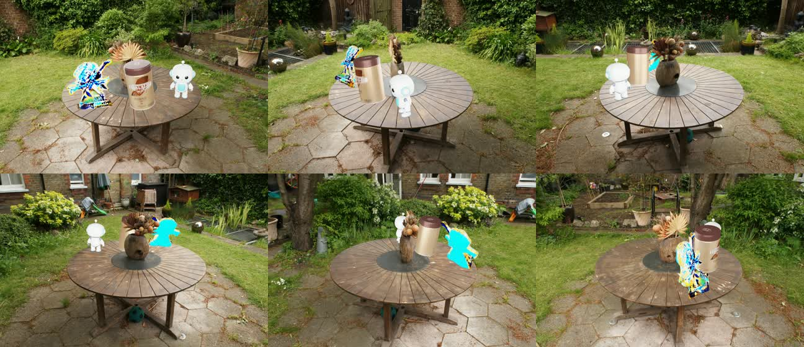
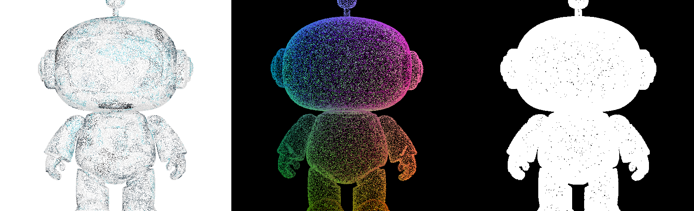
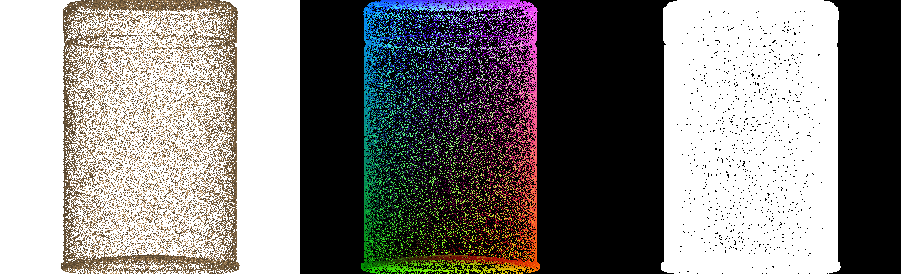
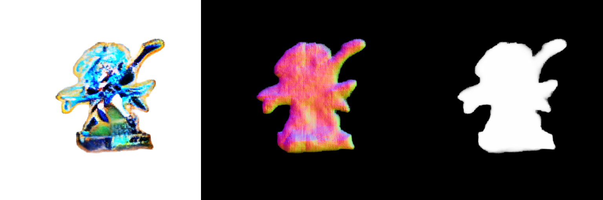
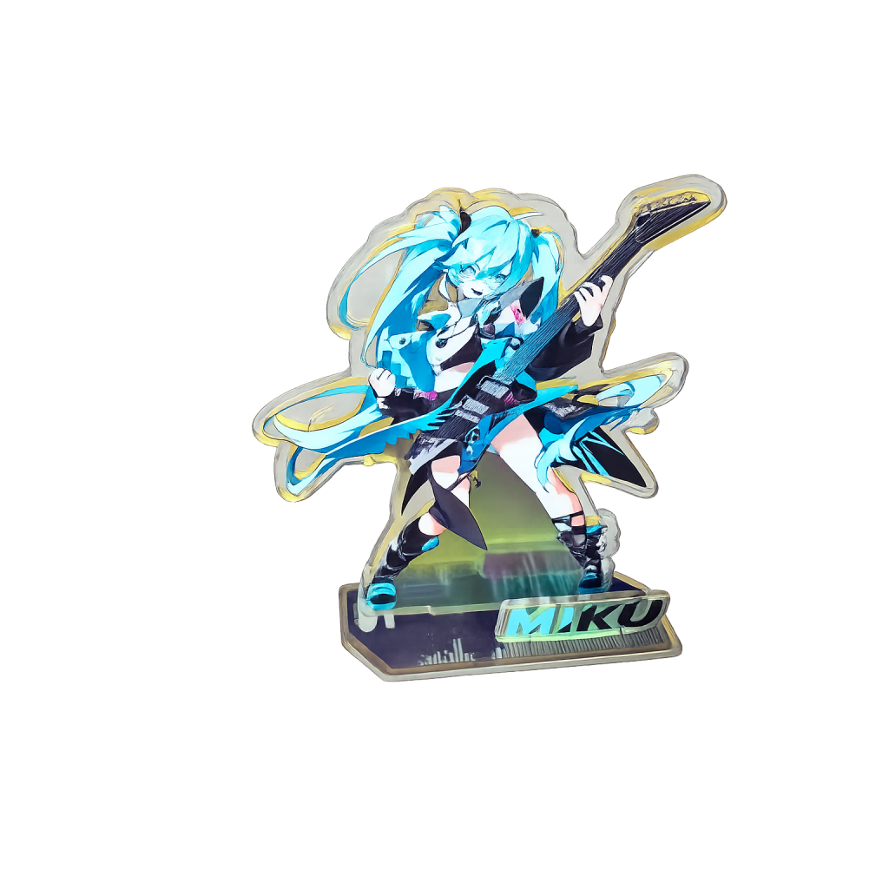
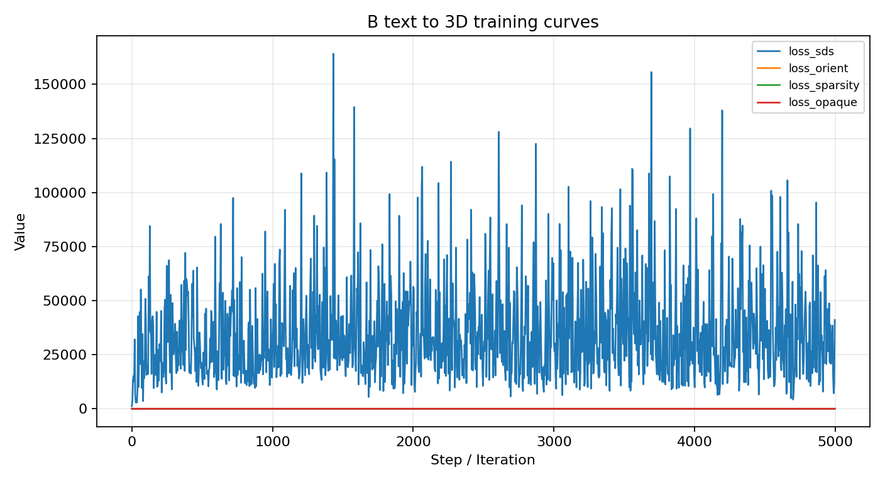
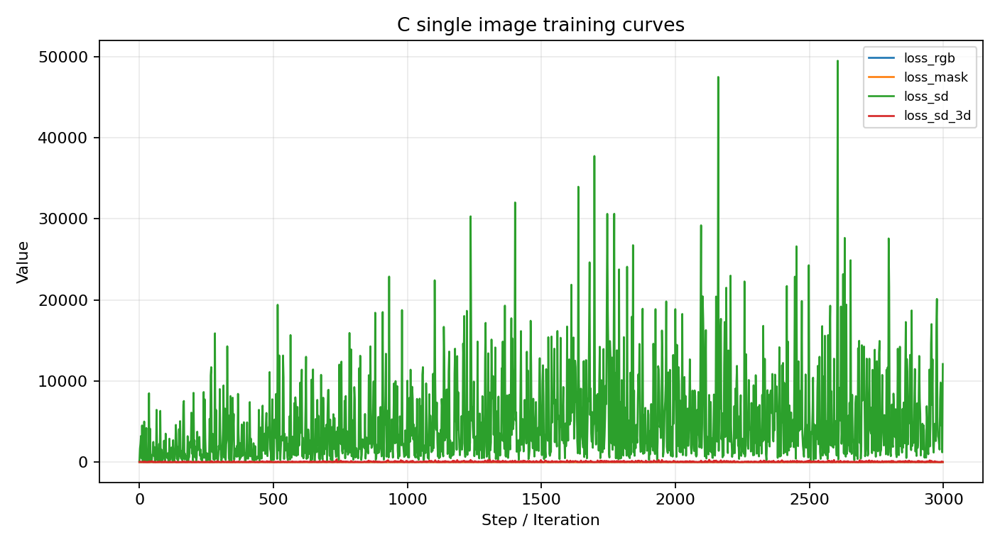
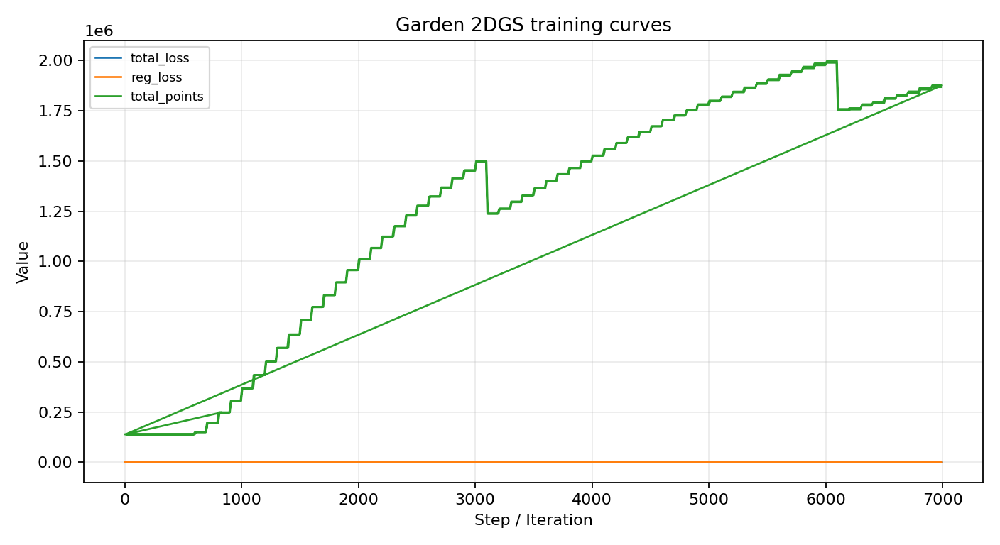

# 计算机视觉期末作业

本仓库包含两个任务的代码、配置、可视化结果与复现实验命令。

- 题目一：基于 2DGS 与 AIGC 的多源资产生成与真实场景融合
- 题目二：基于 LeRobot ACT 的 CALVIN 跨环境泛化实验

| 内容 | 链接 |
|---|---|
| 题目一最终融合视频 | [task1/assets/videos/garden_ABC_final_true_depth_stable.mp4](task1/assets/videos/garden_ABC_final_true_depth_stable.mp4) |
| 题目一 WandB | [cv_hw3_task1/x6p97rhc](https://wandb.ai/escan0r-fudan/cv_hw3_task1/runs/x6p97rhc) |
| 题目一权重与大文件 | [Google Drive](https://drive.google.com/file/d/1Na939jnmL_tf0ylUOD7fsgpnOoXWfuRd/view?usp=sharing) |
| 题目二 WandB | [calvin-act-val-curves](https://wandb.ai/escan0r-fudan/calvin-act-val-curves) |
| 题目二权重 | [Google Drive](https://drive.google.com/file/d/14H8HYwJ4SKynrkCx36ngJ8cSX7DytoZK/view?usp=sharing) |

## 仓库结构

```text
.
├── README.md
├── task1/
│   ├── assets/
│   │   └── videos/
│   ├── assets_preview/
│   ├── configs/
│   ├── metrics/
│   └── scripts/
└── task2/
    ├── environment.yml
    ├── src/
    ├── scripts/
    ├── figures/
    └── report/
```


## 题目一：2DGS 与 AIGC 场景融合

任务目标是完成一个全链路 3D 视觉流程：真实物体多视角重建、AIGC 虚拟资产生成、开源真实场景 2DGS 重建，以及三类物体在统一背景中的融合渲染。



### 任务模块

| 模块 | 技术路径 | 输入 | 输出 |
|---|---|---|---|
| 物体 A：真实多视角重建 | 手机视频 + COLMAP + 2D Gaussian Splatting | 环绕视频 / 多视角抽帧 | 2DGS 重建结果、点云 / 高斯资产 |
| 物体 B：文本到 3D 生成 | threestudio + 预训练 2D 扩散模型 + SDS Loss | 文本 Prompt | 3D 虚拟物体、mesh / GLB |
| 物体 C：单图到 3D 生成 | 去背景单图 + Magic123 | 单张真实物体图像 | 带纹理 OBJ 模型 |
| 背景场景 | Mip-NeRF 360 Garden + 2DGS | Garden 多视角数据 | 背景 2DGS、RGB/depth 渲染帧 |
| 场景融合 | Blender 前景渲染 + 2DGS 背景 + 深度合成 | A/B/C + Garden | 多视角漫游视频 |

### 结果预览

| 结果 | 预览 |
|---|---|
| 物体 A：真实多视角重建 |  |
| 物体 B：文本到 3D 生成 |  |
| 物体 C：单图到 3D 生成 |  |
| A/B/C 插入 Garden 后的融合结果 |  |

最终漫游视频：

```text
task1/assets/videos/garden_ABC_final_true_depth_stable.mp4
```

### 环境配置

2DGS 环境使用 Pixi 管理，threestudio / Magic123 通过脚本调用。

| 项目 | 配置 |
|---|---|
| Python | 3.10 |
| CUDA | 12.4 |
| PyTorch | 2.4.1 + cu124 |
| 包管理 | Pixi 0.65.0 |
| 主要工具 | COLMAP, 2DGS, threestudio, Magic123, Blender, FFmpeg |

安装与检查示例：

```powershell
cd task1/2d-gaussian-splatting
pixi run cuda-check
pixi run install-torch-pip
pixi run install-pip-deps
pixi run install-ext
```

### 数据准备

物体 A 视频抽帧：

```powershell
mkdir task1/object_A/images
ffmpeg -i task1/object_A/input_video/object.MP4 -vf "fps=3,scale=1600:-1" task1/object_A/images/%04d.jpg
```

物体 A COLMAP 位姿估计：

```powershell
cd task1/object_A
mkdir distorted/sparse
colmap feature_extractor --database_path distorted/database.db --image_path images --ImageReader.single_camera 1 --ImageReader.camera_model OPENCV
colmap exhaustive_matcher --database_path distorted/database.db
colmap mapper --database_path distorted/database.db --image_path images --output_path distorted/sparse
```

物体 B 文本 Prompt：

```text
cute white silver toy robot, oval head, black round eyes, tiny nose, short antenna,
cyan chest panel, blue joints, short arms and legs, standing upright, symmetric,
smooth glossy plastic, isolated 3D asset
```

物体 C 使用去背景后的真实物体图像作为 Magic123 输入。



背景场景选用 Mip-NeRF 360 数据集中的 Garden 场景。

### 训练命令

训练物体 A 的 2DGS：

```powershell
cd task1/2d-gaussian-splatting
python train.py -s ../object_A/output -m output/object_A
```

训练 Garden 背景 2DGS：

```powershell
cd task1/2d-gaussian-splatting
python train.py -s ../background/garden -m output/background_garden -r 4 --depth_ratio 0
```

训练物体 B：

```powershell
cd task1/third_party/threestudio
powershell -NoProfile -ExecutionPolicy Bypass -File scripts/run_win.ps1 launch.py --config ../../configs/object-b-dreamfusion-sd-hash.yaml --train --gpu 0
```

训练物体 C：

```powershell
cd task1/third_party/Magic123
python launch.py --config ../../configs/magic123-coarse-sd.yaml --train --gpu 0
```

### 渲染与融合

渲染 Garden 轨迹后，将 A/B/C mesh 在 Blender 中按同一相机轨迹渲染透明前景帧，再用深度图完成遮挡关系合成：

```powershell
cd task1/scripts
python render_trellis_ab_on_garden.py
python composite_garden_objects.py
```

本任务的关键问题是表达形式不统一：Garden 背景由 2DGS 显式高斯面片表示，而 threestudio / Magic123 生成的资产通常是隐式场或 mesh。实验采用渲染级统一方式：

1. 使用 2DGS 沿同一相机轨迹渲染 Garden RGB 帧和 depth 帧。
2. 将 A/B/C 导入 Blender，并使用相同相机轨迹渲染透明前景帧。
3. 使用不透明材质 pass 输出 A/B/C 的 EXR depth，避免透明材质写入错误深度。
4. 将 Blender EXR depth 转为 NPY，并修正 EXR 垂直翻转。
5. 逐像素比较 `asset_depth` 与 `garden_depth`，完成合成。

### 指标与运行时间

| 模块 | 运行时间 | 最终 step | 关键指标 |
|---|---:|---:|---|
| 物体 A 2DGS | 约 36.9 min | 7000 | 保存 2DGS PLY 与相机文件 |
| 物体 B SDS | 约 9.70 h | 4999 logged | loss_sds=29396.4, loss_orient=0.0433 |
| 物体 C Magic123 | 约 4.84 h | 2999 | loss_rgb=0.00320, loss_mask=0.00691 |
| Garden 2DGS | 约 0.66 h | 7000 | total_loss=0.07269, total_points=1.868M |

完整指标见：

```text
task1/metrics/metrics_summary.txt
```

线上 WandB 记录：

```text
https://wandb.ai/escan0r-fudan/cv_hw3_task1/runs/x6p97rhc
```

| 物体 B：SDS | 物体 C：Magic123 | Garden：2DGS |
|---|---|---|
|  |  |  |

## 题目二：LeRobot ACT 跨环境泛化

本任务在 CALVIN 数据集上使用 LeRobot 框架中的 ACT（Action Chunking Transformer）算法训练视觉-动作策略，并在未见过的环境 D 上进行 zero-shot 动作误差评估。

### 实验结果

两组模型使用相同 ACT 网络结构和超参数，仅训练数据不同。

| 模型 | 训练数据 | 最终训练 Loss | 最终训练 Action L1 | 最终验证 Action L1 |
|---|---|---:|---:|---:|
| B-only | CALVIN 环境 B | 0.202813 | 0.199942 | 0.251965 |
| A+B+C joint | CALVIN 环境 A、B、C | 0.235493 | 0.239299 | 0.255756 |

在未参与训练的环境 D 上进行 zero-shot 动作误差评估：

| 模型 | Chunk Action L1 | First-action L1 |
|---|---:|---:|
| B-only | 0.215355 | 0.154377 |
| A+B+C joint | 0.172802 | 0.126927 |

A+B+C joint 模型相比 B-only 模型在环境 D 上将 chunk-level Action L1 降低了 **19.76%**。

### WandB 链接

- 项目主页：<https://wandb.ai/escan0r-fudan/calvin-act-val-curves>
- B-only run：<https://wandb.ai/escan0r-fudan/calvin-act-val-curves/runs/87h3dw7h>
- A+B+C joint run：<https://wandb.ai/escan0r-fudan/calvin-act-val-curves/runs/kzwrndpi>

### 环境配置

```bash
cd task2
conda env create -f environment.yml
conda activate calvin-act
```

### 数据准备

```bash
cd task2
bash scripts/prepare_calvin_data.sh /root/autodl-tmp/cv_hw3_task2/data/calvin-lerobot
```

期望的数据目录结构：

```text
/root/autodl-tmp/cv_hw3_task2/data/calvin-lerobot/
├── splitA/
├── splitB/
├── splitC/
└── splitD/
```

训练阶段使用 splitB 训练基础模型，使用 splitA、splitB、splitC 训练联合模型，测试阶段使用 splitD 做 zero-shot 评估。

### 模型训练

训练 B-only 基础策略：

```bash
cd task2
bash scripts/train_act_b_only.sh
```

训练 A+B+C 多环境联合策略：

```bash
cd task2
bash scripts/train_act_joint_abc.sh
```

两组训练使用相同主要超参数：

| 超参数 | 数值 |
|---|---:|
| Batch size | 64 |
| Training steps | 12,000 |
| Learning rate | 1e-5 |
| Optimizer | AdamW |
| Action chunk size | 64 |
| Loss | Action L1 + KL regularization |
| Validation interval | 每 1,000 steps 验证一次 |

### 环境 D Zero-shot 测试

```bash
cd task2
bash scripts/evaluate_zero_shot_d.sh
```

该脚本计算离线动作预测误差：

- Chunk-level Action L1
- First-action L1

### 图表导出

```bash
cd task2
bash scripts/export_result_plots.sh
```

报告中使用的图表已放在 `task2/figures/` 目录：

| 图表 | 文件 |
|---|---|
| 训练 total loss | `task2/figures/fig_train_total_loss.png` |
| 训练 Action L1 | `task2/figures/fig_train_action_l1_loss.png` |
| 验证 total loss | `task2/figures/fig_validation_total_loss.png` |
| 验证 Action L1 | `task2/figures/fig_validation_action_l1_loss.png` |
| 环境 D zero-shot 动作误差 | `task2/figures/fig_zero_shot_d_action_error.png` |

## 模型权重与文件

仓库保留代码、配置、预览图、曲线和最终视频。checkpoint、完整训练输出、原始数据和模型文件通过网盘提供。

| 任务 | 内容 | 链接 |
|---|---|---|
| 题目一 | 2DGS 输出、AIGC 模型、WandB 日志、完整中间结果 | [Google Drive](https://drive.google.com/file/d/1Na939jnmL_tf0ylUOD7fsgpnOoXWfuRd/view?usp=sharing) |
| 题目二 | ACT 最终 checkpoint | [Google Drive](https://drive.google.com/file/d/14H8HYwJ4SKynrkCx36ngJ8cSX7DytoZK/view?usp=sharing) |

